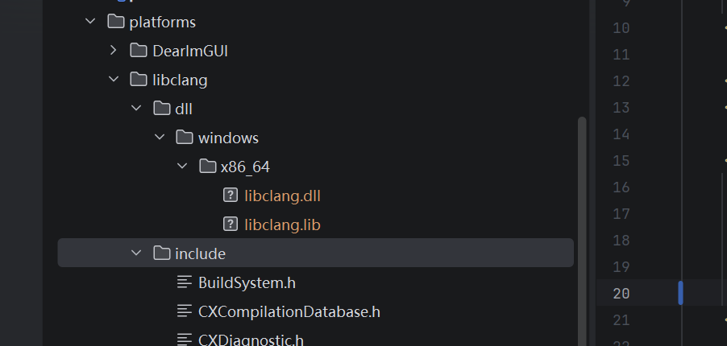
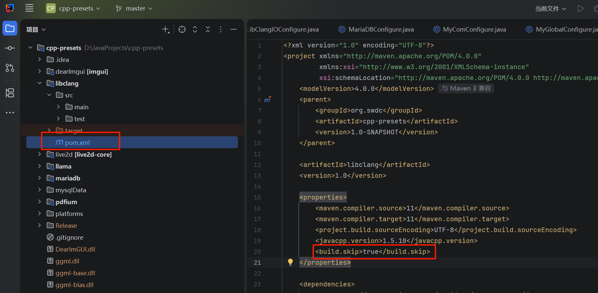
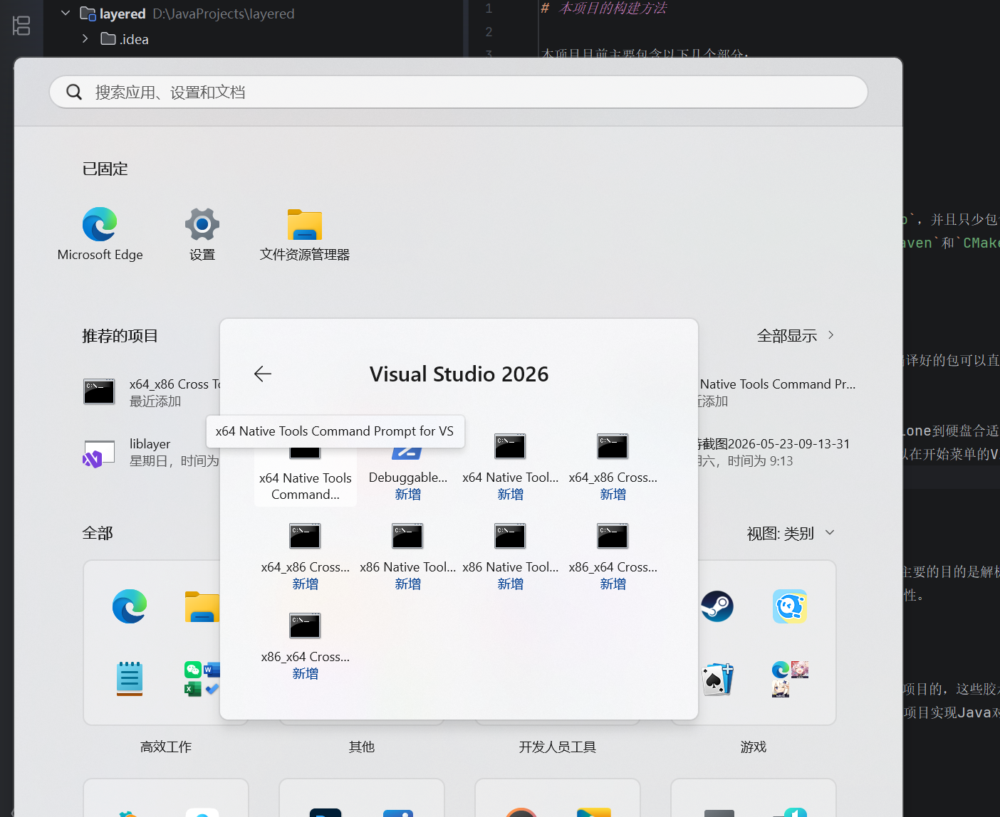
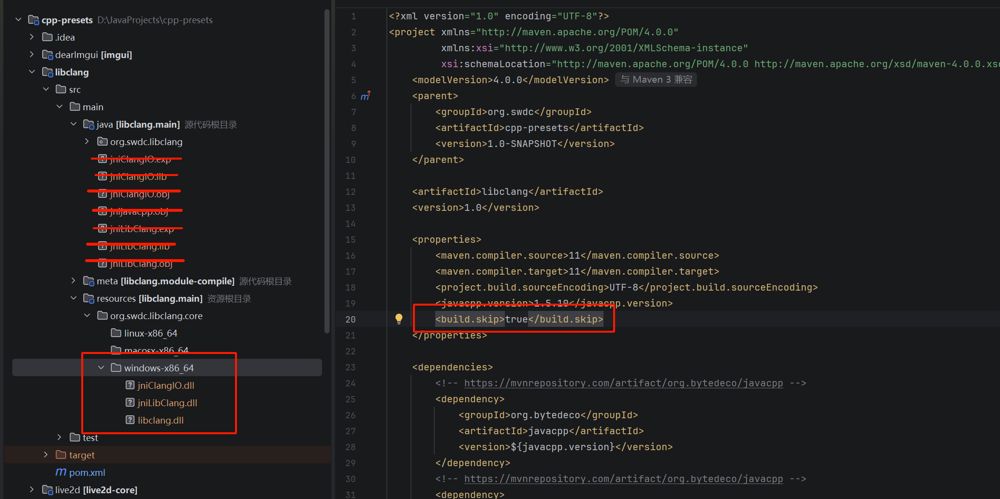

# 本项目的构建方法

本项目目前主要包含以下几个部分：

1. libclang基础项目
2. Layered Header Parser
3. Layered Java Runtime
4. Layered Maven plugin

想要构建本项目，需要安装`Microsoft Visual Studio`，并且只少包含`C/C++`组件，
`CMake`工具，`Java 11+`，`Maven`，并且务必将`Maven`和`CMake`以及`Java`配置到环境变量`PATH`
以便于接下来在命令行中访问。

- Maven可以在这里找到：https://maven.apache.org/download.cgi
- CMake可以在这里找到：https://cmake.org/
- Java可以在这里找到： https://adoptium.net/zh-CN
- vcpkg可以在这里找到：https://github.com/Microsoft/vcpkg
- libclang和llvm可以在这里找到：https://github.com/llvm/llvm-project/releases
- Visual studio，这个就不贴了，自己去翻微软官网。


## libclang基础项目

这个项目目前是我的cpp-presets项目的一部分，应该有编译好的包可以直接使用，也可也通过github拉取该项目
并且编译和安装到本地Maven中（推荐）。

请首先从GitHub获取cpp-presets项目，并且解压或者clone到硬盘合适的位置，接下来，
导航至cpp-presets项目的根目录，使用你的IDE打开该项目，找到它的`libclang`子项目的`pom.xml`并且
进行如下修改：

下载一份clang编译器，大小大概1G上下，里面可以找到libclang.lib（位于解压后的libs目录）
和libclang.dll（位于解压后的bin目录），把它们复制到`cpp-presets`项目的`platform/libclang/dll/windows/x86_64`
目录中：



接下来将下图标出的`build.skip`配置修改为false，这样Maven将会通过`JavaCpp`生成`libclang`的JNI wrapper。



完成修改后，打开开始菜单，在里面找到Visual studio的目录，里面有`Visual studio x64 native tools`命令行，
你应该可以在开始菜单的Visual studio目录中找到它：



打开后，在命令行窗口导航到存放`cpp-presets`的目录，执行下面的指令来进行编译：

```bash
mvn -pl libclang package
```

你会在`libclang.main`这个位置看到很多编译产物，请把生成的dll移动到`libclang`项目合适的位置，
也就是`resource/org/swdc/libclang/core/windows-x86_64`这里面，此外，`libclang.dll`
也需要放进去，整理完毕的项目如下图：



接下来将`build.skip`配置修改为true，删除dll之外其他的编译产物，并且执行以下指令：

```bash
mvn -pl libclang clean
mvn -pl libclang package
mvn -pl libclang install
```

那么到这里libclang的Java wrapper就准备完毕了。
这个项目想要正常运转，还需要它的parent-project，我估计后期会单独把它拆出来避免这种麻烦的问题。

## Layered Java运行时库

这个项目展示了Java是如何使用头文件解析器生成的CMake项目的，这些胶水代码已经将各种API的接口进行了
规范，并且提供了必要的元数据，通过这些就能借助libffi项目实现Java对外部函数的调用，该项目目前在进行
可用性的验证。

本项目也分为native（C/C++）和Java的两个部分，native部分主要提供了内存操作以及`libffi`的外部函数调用
能力，而Java部分则是对native的操作封装，Java的部分不需要特别的处理，关键在于它的本地库。

这个项目使用`vcpkg`，所以你需要首先下载一份`vcpkg`的release包，并且解压到`layered-runtime/native/vcpkg`目录里面，
本项目不会把`vcpkg`打包在内，不然体积就太大了。

在继续之前，你需要再有管理员权限的`Windows PowerShell`命令行中执行以下指令：

```bash
Set-ExecutionPolicy -ExecutionPolicy RemoteSigned -Scope CurrentUser
```

它的目的是允许Power shell执行脚本，本项目需要这项权限来使用vcpkg。

同样的，你需要使用Visual studio的cli环境启动本项目的编译，在开始菜单找到Visual studio，里面有`Visual studio x64 native tools`命令行，
你应该可以在开始菜单的Visual studio目录中找到它：


在这个命令行中，你需要导航到`layered-runtime`的`native`目录，并且执行以下指令启动编译：

```bash
mkdir build
cmake -B build
```

此时在build目录下应该已经生成了Visual studio的Project（`.sln`），打开它吧，通过Visual studio应该可以
正确的生成所需的二进制库，顺便，如果cmake执行过程遇到了问题，那么很可能是网络导致的，多试几次总会成功。

如果你使用的是`Debug`模式，那么你可以在build目录的`Debug`子目录找到生成的动态库，如果是`Release`模式，你可以
在`Release`子目录找到它，这里面所有的动态库都是本项目需要的，需要把它们复制到resource目录的以下位置：

`org/swdc/layered/module/windows-x86_64`

接下来你可以对本项目指向Maven的install指令，Layered Java运行时库就准备完毕了。

当然，如果不想使用IDE，通过以下指令也能编译它：

```bash
cd build
cmake --build . --config release
```

## Layered 头文件解析器

这个项目是基于libclang实现的C语言Header解析工具，主要的目的是解析头文件`*.h`并且从中提取元数据，
生成胶水代码和CMake项目，目前正在验证对于C语言的可用性，它复用了一部分Layered Java运行时库的组件，
所以构建本项目之前需要首先构建这个Layered Java运行时库。

