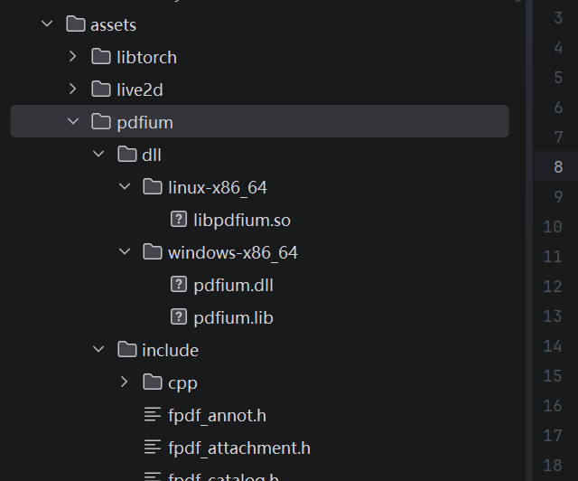
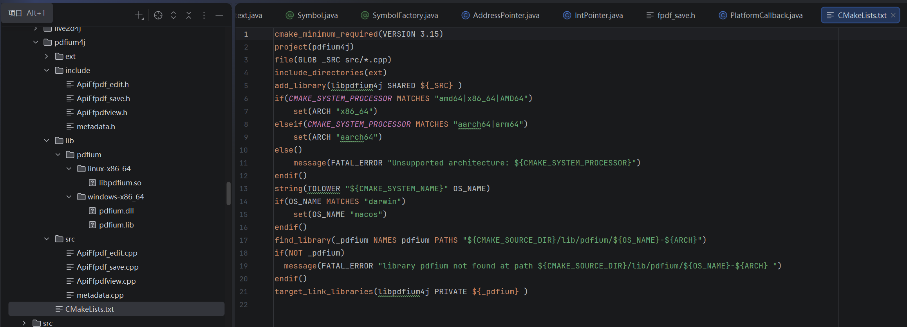
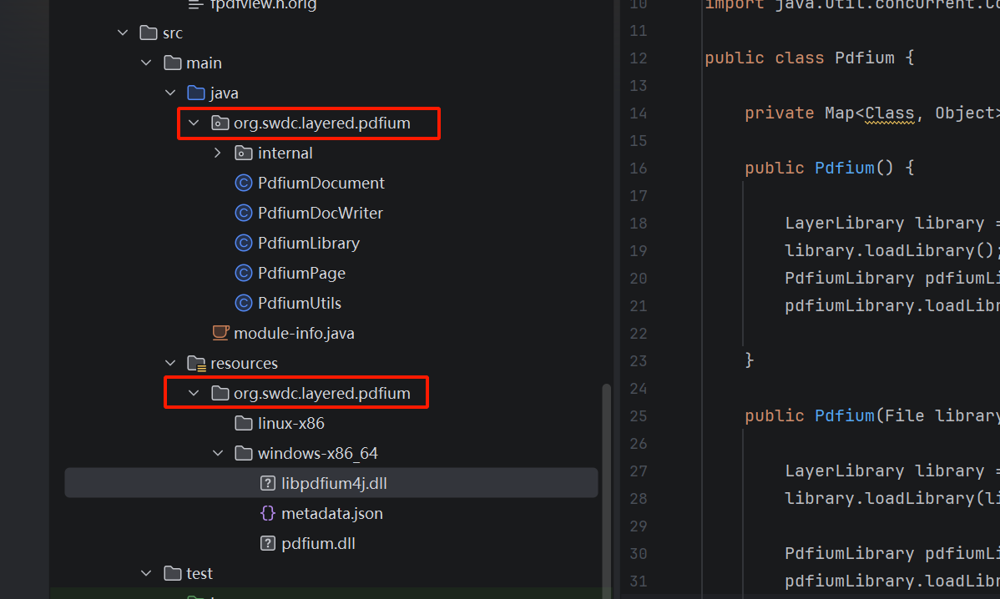

# 本项目的用法

> 本项目还在持续改进，这里的文档会随着版本的更新而变动。

使用本项目包装本地库，大体上分以下几个步骤：

首先，解析一个本地库的Header之前，我们需要整理一下这个本地库，它只少需要包含Include目录（以及必要的头文件）
和动态链接库目录，就像这样：



链接库目录应该按照“osName-arch”这种格式创建子目录，并且将对应操作系统可用的链接库放入其中，这样一来，准备工作
就完成了，只需要通过像下面的方法，就能生成一个CMake项目。

```java
public class Demo {
    
    public static void main(int argc, String[] argv) {
        
        // 添加想要包装的Header
        File targetHeader = new File("assets/pdfium/include/fpdfview.h");
        File targetHeaderEdit = new File("assets/pdfium/include/fpdf_edit.h");
        File targetSave = new File("assets/pdfium/include/fpdf_save.h");

        // 创建Clang解析器，指定参数和include目录。
        CLangParser parser = new CLangParser(Arrays.asList("-v"), Arrays.asList(
                new File("assets/pdfium/include"),
                new File("assets/pdfium/include/cpp")
        )).addHeaders(targetHeader,targetHeaderEdit,targetSave);
        // 执行Header解析
        parser.parse();

        try {
            
            // 创建一个ProjectWriter，它用于写入CMake项目。
            NativeProjectWriter projectWriter = new NativeProjectWriter("pdfium4j", new File("out/pdfium4j"));
            // 添加本地库的Include目录，这个会被复制到项目中。
            projectWriter.addLibraryHeader(new File("assets/pdfium/include"));
            // 这是lib的目录，里面包含了必要的链接库文件。
            // 这个目录内部应该按照“osName-arch”这样的子目录，
            // 因为生成的CMakeList会按照这种方式查找对应的链接库。
            projectWriter.addLibrary("pdfium", new File("assets/pdfium/dll"));
            // 添加CMake应该链接的库
            projectWriter.linkLibrary("pdfium");
            // 创建Project
            projectWriter.createProject();
            
            // 源码生成
            SourceGenerate generate = new SourceGenerate();
            for (File file : parser.getHeaders()) {
                
                // 获取Header文件的Context，每一个Context对应一个头文件
                ClangContext context = parser.getContext(file);
                // 创建Context生成的上下文。
                SourceContext sourceContext = generate.createContext();
                // Struct相关的源码生成器。
                StructSourceWriter writer = new StructSourceWriter();
                for (NativeStructType struct : context.getDeclaredStructs()) {
                    // 从Metadata生成Struct的Getter和Setter以及构造和析构函数
                    writer.createCalls(sourceContext,struct);
                }

                // Function相关的源码生成器。
                FunctionSourceWriter functionWriter = new FunctionSourceWriter();
                for (NativeFunction function : context.getDeclaredFunctions()) {
                    // 从Metadata生成函数调用接口
                    functionWriter.createCalls(sourceContext,function);
                }
                
                // 写入源文件
                projectWriter.writeSource(file, sourceContext);

            }

            // 写入API的Metadata数据到源文件中。
            projectWriter.writeEntryPoint();

        } catch (Exception e) {
            e.printStackTrace();
        }
    }
    
}
```
以上源码顺利执行后，应该会生成类似这样的CMake项目：



这个CMake项目是非常单纯的CMake项目，不涉及JNI或者其他与某个语言强相关的内容， 因此这种wrapper某种意义上可以跨语言通用，
这也是本项目一开始就制定好的目标，使用`Visual studio`的那个`Visual studio x64 native tools`命令行以及CMake工具，
就能正确的编译生成这个Wrapper。

想要使用这样的Wrapper，就需要通过Layered Java runtime了。

这个Layered Java runtime提供了基础的内存管理能力和libffi为基础的外部调用能力，借助这些能力目前已经可以把比较基础的
C语言库接入Java环境了。

首先，我们需要关注`AbstractLayerLibrary`这个类，它位于`org.swdc.layered.module`，继承这个Class并且提供一个
合适的名称，以便于在运行的时候释放我们的本地库，就像这样：

```java

public class PdfiumLibrary extends AbstractLayerLibrary {

    private static final PdfiumLibrary instance = new  PdfiumLibrary();

    private PdfiumLibrary() {

    }

    @Override
    public String getLibraryName() {
        return "pdfium";
    }

    public static PdfiumLibrary getInstance() {
        return instance;
    }

}
```
接下来，将编译好的wrapper以及必要的本地链接库放到合适的位置，通常来说，需要位于Resource目录中的
与这个继承了`AbstractLayerLibrary`的子类一致的路径中，方便在需要的时候定位和释放它，举个例子：

如果PdfiumLibrary位于`org/swdc/layered/pdfium`，那么本地库应该放在`resource`目录的`org/swdc/layered/pdfium`
里面，就像这样：



接下来我们需要编写一个加载的配置文件，它的名字是`metadata.json`，这个文件非常简单，它主要用于处理类库的加载顺序，
应该优先加载被依赖的动态库，接下来才能加载依赖它的库，因为本项目的库可以存放在任意位置，操作系统不会主动去我们指定的位置查找依赖库，
所以，通过这种方式依次加载必要的链接库是非常重要的。

```json
[{
  "name": "pdfium",
  "fileName": "pdfium.dll",
  "vmLoad": true,
  "dep": []
},{
  "name": "pdfium4j",
  "fileName": "libpdfium4j.dll",
  "vmLoad": false,
  "dep": [ "pdfium" ]
}]
```

它包含一个数组，每一项都代表着一个本地的动态库，它的各个字段含义如下：

 - name：这个库的名字，这是一个id，用于标识一个动态库。
 - fileName：这是这个库的文件名
 - vmLoad：这个库是否通过Java加载，如果它是必要的依赖库，请把它设置为true，如果它是本项目生成的wrapper，设置为false。
 - dep：这个库依赖的其他动态库（需要包含在metadata的json内部）

通常来说，我们不需要包含完整的CRT（Java自然是带了CRT的），但是，对于Windows来说，如果你的库使用的是GNU所编译的C库，
你就需要把它的CRT也放进来。

接下来，需要准备一个接口，目的是提供加载这些本地库，并且提供API调用的能力：

```java
public class Pdfium {

    private Map<Class, Object> api = new ConcurrentHashMap<>();

    public Pdfium(File libraryFolder) {

        // 首先呢，务必加载LayeredRuntime的运行时库
        // 运行时库是一切的基础，因此必须提前加载。
        LayerLibrary library = LayerLibrary.getInstance();
        library.loadLibrary(libraryFolder);

        // 接下来加载我们的Wrapper库。
        // 这些库会被释放到libraryFolder的子目录（名称是getLibraryName）中。
        PdfiumLibrary pdfiumLibrary = PdfiumLibrary.getInstance();
        pdfiumLibrary.loadLibrary(libraryFolder);

    }
    
    private <T> T api(Class<T> clazz) {

        PdfiumLibrary pdfiumLibrary = PdfiumLibrary.getInstance();
        // 这个loadModule需要的Name实际上是metadata.json提供的，
        // 如果你给这个本地库起了很多不同的name，这里应该写metadata.json的那个name
        // 因为这个loadModule的目的就是选择合适的动态库，所以需要的是动态库的name。
        PlatformModule module = pdfiumLibrary.loadModule("pdfium4j");
        if (module == null) {
            throw new NullPointerException("pdfium4j module not found");
        }
        if (api.containsKey(clazz)) {
            return (T) api.get(clazz);
        }
        // 提供的Class应该是一个接口，本项目使用JDK代理。
        T apiProxy = module.createCallProxy(clazz);
        api.put(clazz, apiProxy);
        return apiProxy;

    }

    // 这个是内存分配器，它可以申请和释放本地内存，非常有用，所以务必提供。
    // 通常来说，直接使用Module的Allocator是可行的，但是如果想要更精细的控制
    // 内存，统一进行内存的释放，也可以自己创建Allocator。
    public Allocator allocator() {
        PdfiumLibrary pdfiumLibrary = PdfiumLibrary.getInstance();
        PlatformModule module = pdfiumLibrary.loadModule("pdfium4j");
        if (module == null) {
            throw new NullPointerException("pdfium4j module not found");
        }
        return module.getAllocator();
    }

}

```

完成上述步骤后，就可以创建接口了，借助这些接口就能实现对本地库的最终调用：

```java
public interface PdfiumDocs {

    void FPDF_InitLibrary();

    void FPDF_DestroyLibrary();

    FPdfDocument FPDF_LoadDocument(String filename, String password);

    void FPDF_CloseDocument(FPdfDocument document);

    int FPDF_SaveAsCopy(FPdfDocument document, FPdfFileWrite writer, @TypeDecl(unsigned = true) long flag);

    int FPDF_GetFileVersion(FPdfDocument document, IntPointer fileVersion);

    @TypeDecl(unsigned = true)
    long FPDF_GetLastError();

}
```

像这样的接口中，方法名就是本地库的Header中包含的函数名，参数就是我们使用本地函数所必要的参数，
借助Wrapper的metadata，运行时将会把这些接口中的函数按照名称和参数与本地库的函数进行匹配，最终通过libffi
实现函数调用。

本地库的对象（Struct或者Class）可以通过继承`ObjectivePointer`获得一个在Java体系下的指针，基础类型则可以
直接使用Java的基本类型，基本类型的指针是`SeekablePointer`的子类，至于String则可以对应到字符型的指针。

需要注意的是，虽然Java没有unsigned类型，但是为了兼容性，metadata是会记载哪些是无符号类型的，
因此如果参数或者返回值是无符号的，需要使用TypeDecl注解并且指定unsigned为true。

此外，对于本地对象的Getter和Setter和构造以及删除，这里有单独的注解提供，SymbolFactory注解
用于构造函数和析构函数，通过指定creator和deleteor区分，value是本地对象的名字，SymbolAccessor
用于本地的Getter和Setter。

对于本地函数到Java的回调，需要单独声明一个Java接口，并且标注`FunctionalInterface`注解，这个接口的
对象或者lambda表达式可以通过`PlatformClosure`构造为为`libffi`的`ffi_closure`，从而在本地层面实现回调
的功能，但请注意，你需要在用完之后手动释放这个`PlatformClosure`。

关于这些功能，例子如下：

```java

public interface PdfiumSave {

    @SymbolFactory(value = "FPDF_FILEWRITE_",creator = true)
    FPdfFileWrite FPDF_FileWriteAlloc();

    @SymbolFactory(value = "FPDF_FILEWRITE_",deleter = true)
    void FPDF_FileWriteFree(FPdfFileWrite writer);

    @SymbolAccessor(value = "FPDF_FILEWRITE_", field = "WriteBlock", setter = true)
    void FPDF_FileWrite_SetWriteBlock(FPdfFileWrite writer, PlatformClosure closure);


    @SymbolAccessor(value = "FPDF_FILEWRITE_", field = "version", setter = true)
    void FPDF_FileWrite_SetVersion(FPdfFileWrite writer, int version);


    @SymbolAccessor(value = "FPDF_FILEWRITE_", field = "version", getter = true)
    int FPDF_FileWrite_GetVersion(FPdfFileWrite writer);

}
```

目前这一部分尚处于开发中。